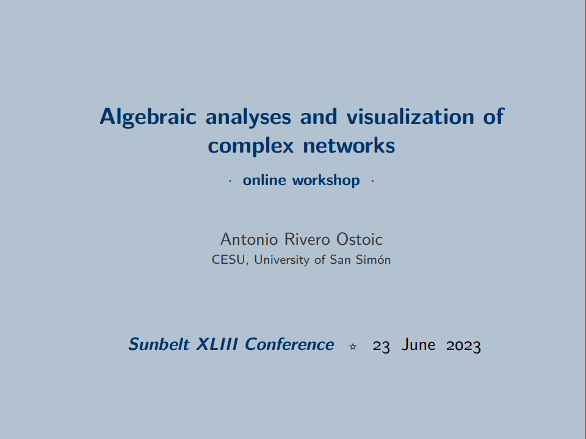
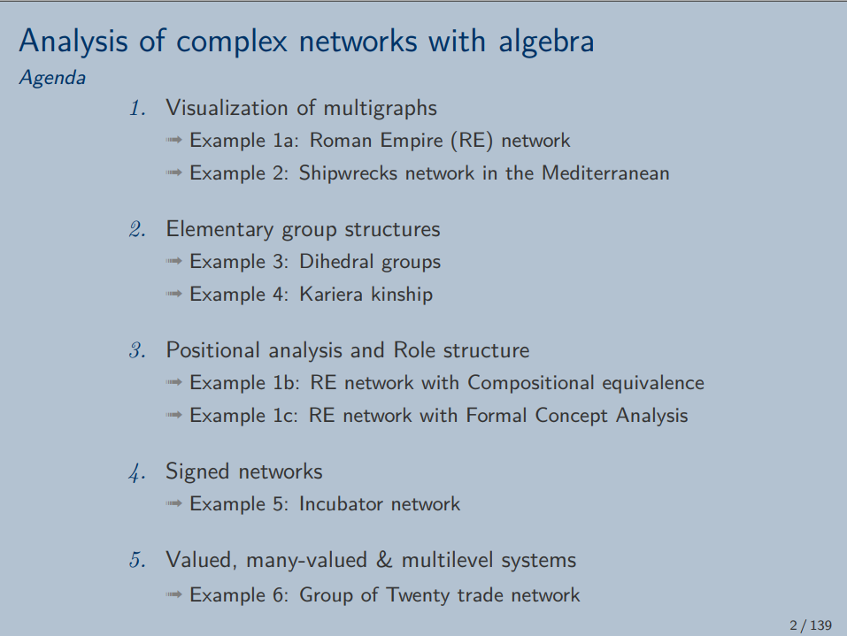

## INSNA Sunbelt 2023 workshop
#### Algebraic analyses and visualization of complex networks
##### 23 June 2023
###### Antonio Rivero Ostoic (@mplex)

 

 

* (part 5) [Multilevel Structure of G20 Trade Network](https://htmlpreview.github.io/?https://github.com/mplex/sunbelt2023/blob/main/pres/Multilevel%20Structure%20of%20G20%20Trade%20Network.html)

 
